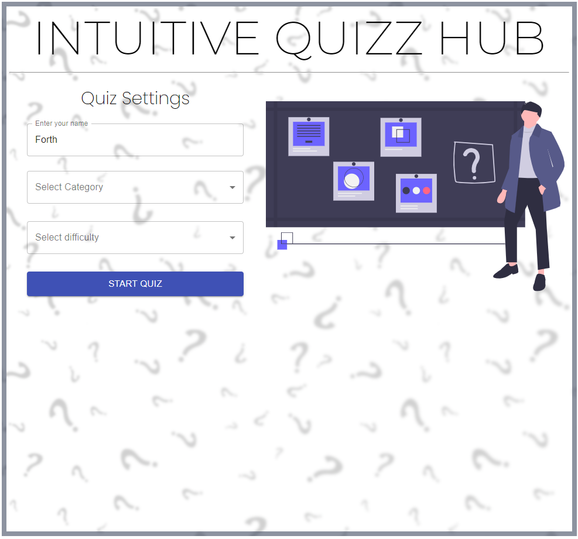
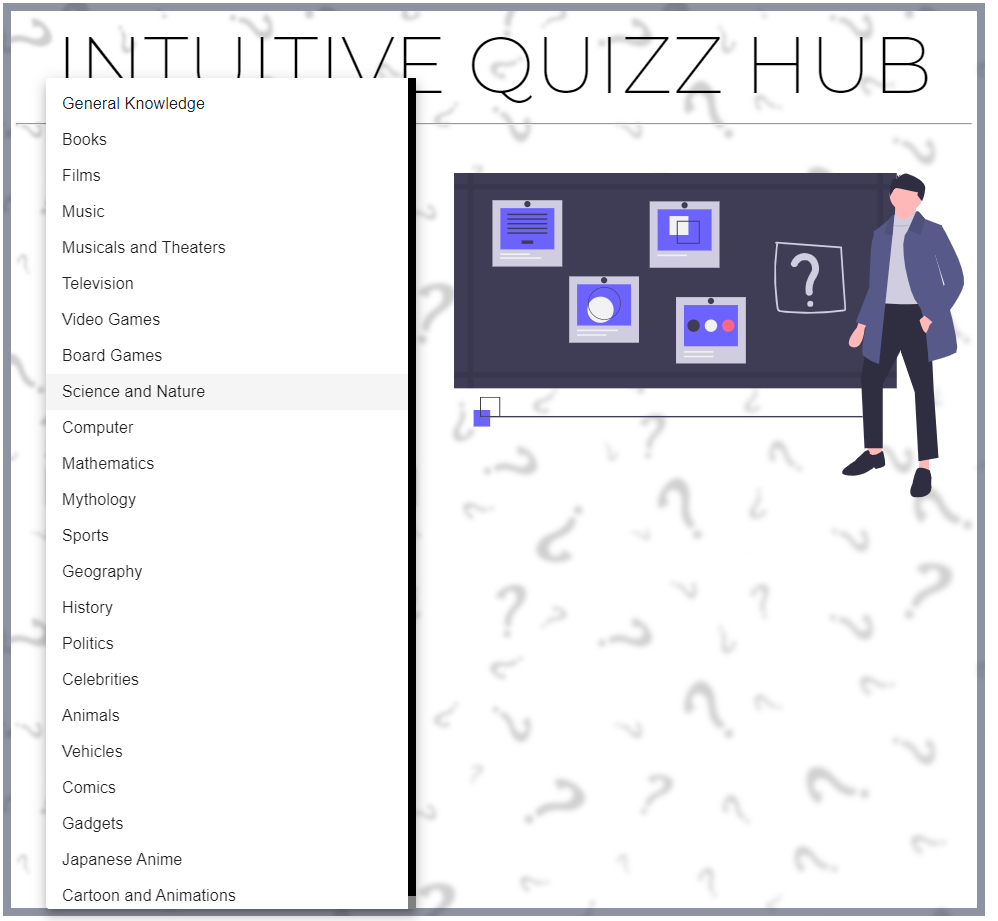
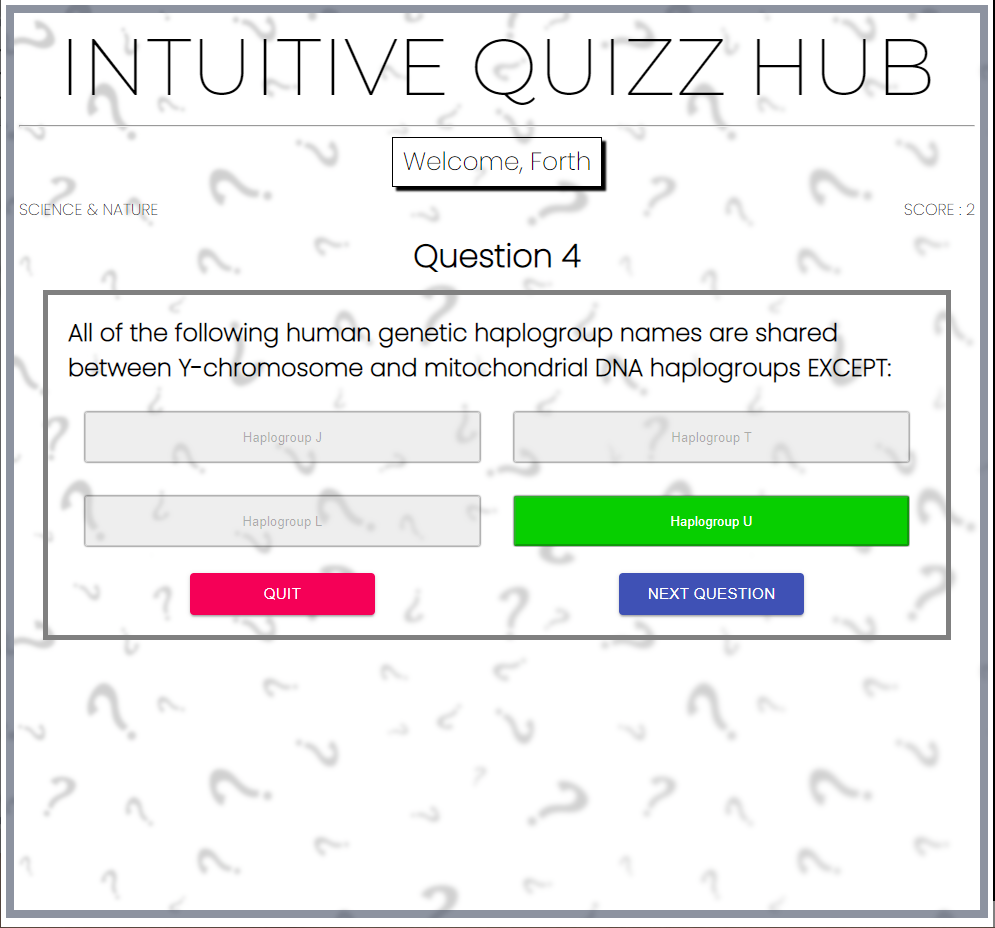
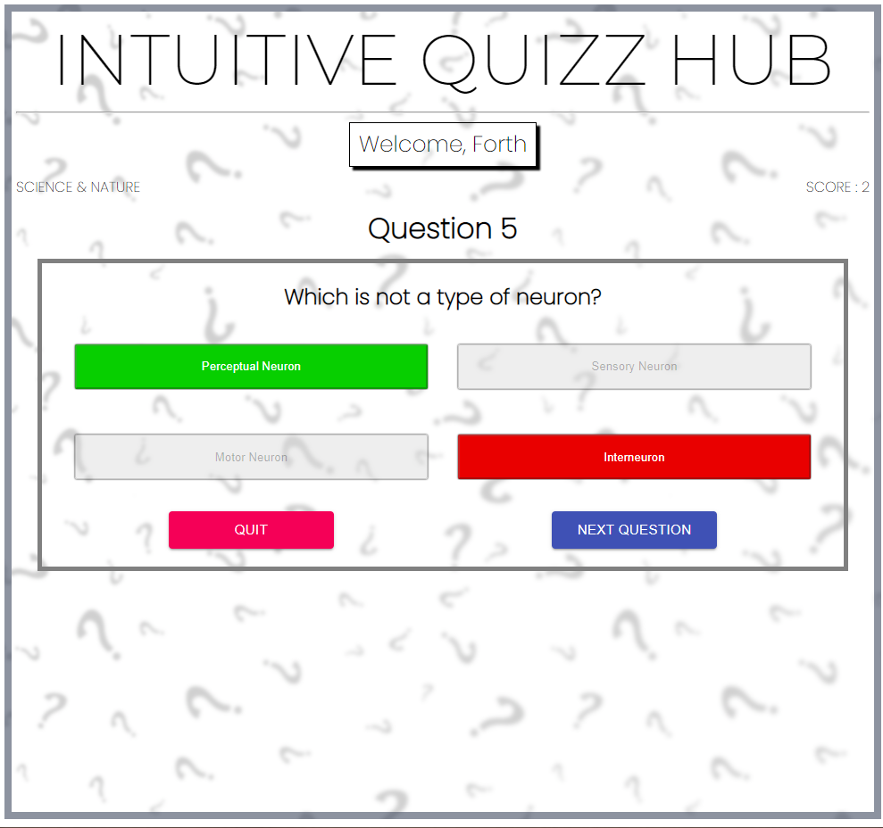
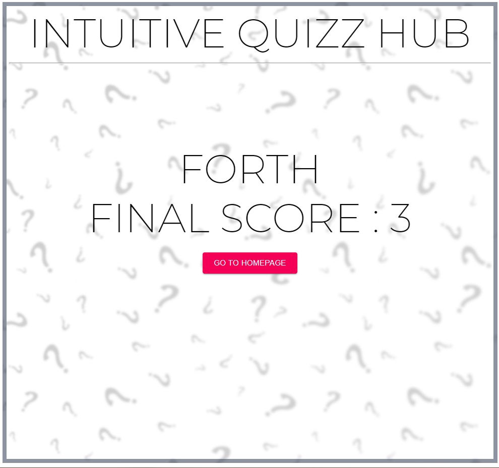

# Introduction

Ce projet est en réact et permet de développer un Quiz. L'utilisateur entre son nom, selectionne une catégorie et une difficulté. L'application récupère les questions via une API que j'avais utilisé lors d'un projet précédent fait en Vanilla JS.

Source de la vidéo : [Quiz App in React JS with 22 Categories | Material UI | React Beginners Project | Trivia API](https://www.youtube.com/watch?v=dg7XmuLvsbs).

# Intérêts du projet

Ayant déjà développé un quiz en Vanilla JS, le faire en Réact permet de voir comment cela simplifie/complique les choses. 

Ce projet va surtout me permettre de pratiquer Réact et Material-UI.

# Difficultés rencontrées

Le projet en soit n'était pas très complexe, il a donc été réalisé sans difficultée adjacente à la vidéo. La seule difficulté a été lié à Material-UI.

## Erreur FindDOMNode

Je suis tombé sur la même erreur que le développeur lors de se vidéo : 

Il a corrigé la solution en retirant le mode strict. Ne souhaitant pas le retirer, je fais pas mal de recherches. Les solutions parlaient d'utiliser la référence de l'objet `useRef` ou `createRef`, mais mes différentes tentatives ont toutes étaient infructueuses.

Utilisant la version 4.11.4 de Material-UI, j'ai tenté avec la version 5.0.0-beta, mais l'erreur était toujours là...

J'ai donc pris la décision d'appliquer la même "solution" que dans la vidéo en retirant le StrictMode.

# Ce que m'a apporté ce projet

Avant tout, de la pratique. J'ai pu voir comment transférer des données d'une page vers une autre pouvait être fastidieux en Réact sans utiliser de store.

Ce projet utilisait pas mal les Elements de Material-UI, ce dont je n'avais pas vraiment utilisé jusque là. Sachant qu'avec Bootstrap, se sont les deux technologies web les plus utilisées pour le design. C'est donc toujours un plus d'apprendre à bien m'en servir.

# Screenshots du projet

